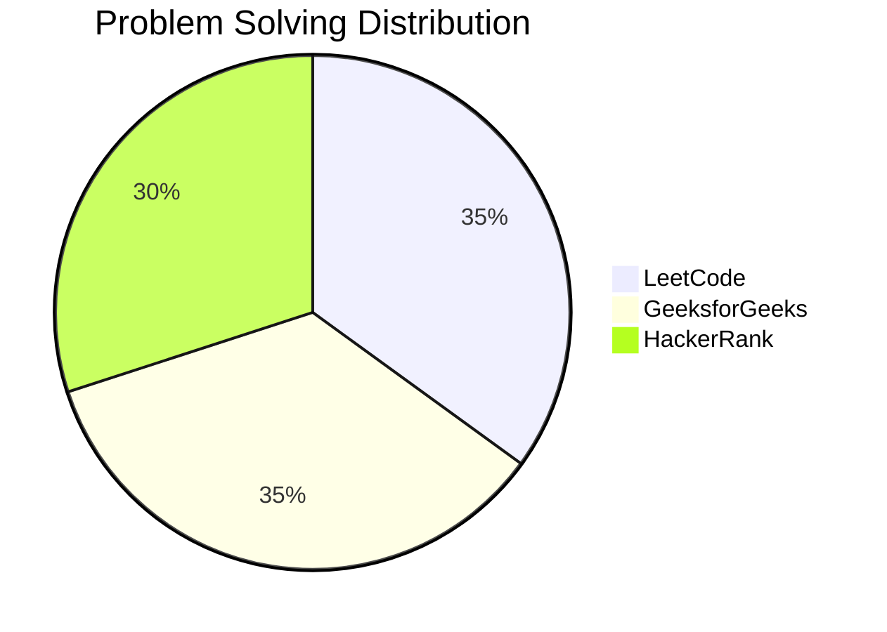
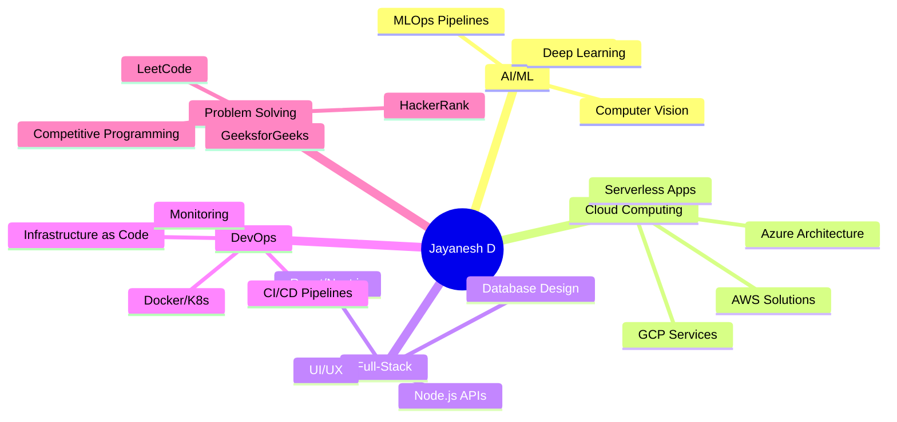

<div align="center">

<!-- Animated Header -->


</div>

<div align="center">
  
<!-- Typing SVG with enhanced styling -->
<a href="https://git.io/typing-svg">
  
</a>

<br/>

<!-- Animated badges -->


</div>

<br/>

<!-- Animated separator -->


<div align="center">

### 🌟 About Me

</div>

```typescript
const jayanesh = {
    location: "India 🇮🇳",
    role: "AI & Cloud Engineer | Full-Stack Developer",
    passions: ["Cloud Computing", "Machine Learning", "IoT", "DevOps"],
    problemSolving: {
        platforms: ["LeetCode", "GeeksforGeeks", "HackerRank"],
        totalSolved: "300+",
        skills: ["Data Structures", "Algorithms", "Competitive Programming"]
    },
    currentFocus: [
        "🤖 Building AI-powered applications with serverless architectures",
        "☁️ Architecting cloud-native systems on AWS, Azure & GCP",
        "🔄 Developing MLOps & DevOps pipelines for scalable deployments",
        "🚀 Creating innovative solutions that bridge AI and Cloud",
        "💡 Solving complex algorithmic challenges daily"
    ],
    lifePhilosophy: "Turning innovative ideas into scalable reality ✨"
};
```

<br/>

<!-- Animated separator -->


<div align="center">

## 💻 Tech Stack & Arsenal

</div>

<div align="center">

### 🔤 Languages
<a href="https://skillicons.dev">
  
</a>

### 🎨 Frontend
<a href="https://skillicons.dev">
  
</a>

### ⚙️ Backend
<a href="https://skillicons.dev">
  
</a>

### 🤖 AI/ML & Data Science
<a href="https://skillicons.dev">
  
</a>
<br/>


### 🗄️ Databases
<a href="https://skillicons.dev">
  
</a>

### ☁️ Cloud & DevOps
<a href="https://skillicons.dev">
  
</a>
<br/>
<a href="https://skillicons.dev">
  
</a>

</div>

<br/>

<!-- Animated separator -->


<div align="center">

## 🏆 Competitive Programming & Problem Solving

<br/>

### 💪 Coding Platforms Stats

<table>
  <tr>
    <td align="center" width="33%">
      
      <br/>
      
      <br/>
      <sub><b>Data Structures & Algorithms</b></sub>
    </td>
    <td align="center" width="33%">
      
      <br/>
      
      <br/>
      <sub><b>Problem Solving & DSA</b></sub>
    </td>
    <td align="center" width="33%">
      
      <br/>
      
      <br/>
      <sub><b>Algorithms & Data Structures</b></sub>
    </td>
  </tr>
</table>

<br/>

### 📈 Problem Solving Journey


<br/><br/>



<br/>

### 🎯 Key Problem Solving Skills


</div>

<br/>

<!-- Animated separator -->


<div align="center">

## 📊 GitHub Analytics & Activity

<br/>

<!-- GitHub Stats Cards with custom styling -->


<br/><br/>

<!-- Top Languages Card -->


<br/><br/>

<!-- Activity Graph -->


<br/>

<!-- Trophy Stats -->


</div>

<br/>

<!-- Animated separator -->


<div align="center">

## 🔭 Current Focus & Projects

</div>

<div align="center">



</div>

<br/>

<div align="center">

### 🎯 Key Areas of Expertise

| 🤖 AI/ML | ☁️ Cloud | 💻 Development | 🔄 DevOps | 🧩 DSA |
|:---:|:---:|:---:|:---:|:---:|
| TensorFlow/PyTorch | AWS Certified | React/Next.js | Docker/K8s | 300+ Problems |
| Computer Vision | Azure Solutions | Node.js/Express | CI/CD Pipelines | Algorithms |
| NLP & LLMs | GCP Infrastructure | Django/Flask | Terraform/Ansible | Data Structures |
| Model Deployment | Serverless | Full-Stack | MLOps | Competitive Coding |

</div>

<br/>

<!-- Animated separator -->


<div align="center">

## 🌐 Let's Connect & Collaborate

<br/>

<a href="https://www.linkedin.com/in/jayanesh2494/">
  
</a>
<a href="mailto:jayanesh2494@gmail.com">
  
</a>
<a href="https://github.com/Jayanesh2494">
  
</a>
<a href="https://leetcode.com/Jayanesh2494/">
  
</a>

<br/><br/>

### 📫 Open for Collaboration On


</div>

<br/>

<!-- Animated separator -->


<div align="center">

### 💭 Random Dev Quote


<br/><br/>

### 😄 Let's Have Some Fun


</div>

<br/>

<!-- Animated separator -->


<div align="center">

### 👀 Profile Views Counter


<br/><br/>

**✨ "Code is like humor. When you have to explain it, it's bad!" ✨**

<br/>

**🏆 "Solving 300+ problems taught me: Persistence beats perfection!" 🏆**

<br/>

<sub>Made with 💙 and lots of ☕</sub>

</div>

<br/>

<!-- Animated Footer -->

